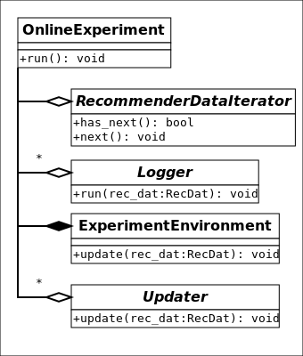
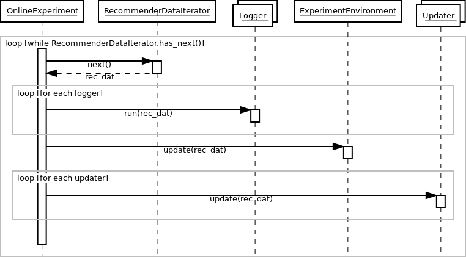

The anatomy of an Alpenglow experiment
======================================

The online experiment runs on a time series of events.  The system performs two steps for each event.  First, it evaluates the recommender, using the event as an evaluation sample.  Second, using the event as training data, allows the recommender model to update itself.

In our C++ implementation, the central class is :py:class:`alpenglow.cpp.OnlineExperiment` that manages the process described above.  The data, the evaluators and the training algorithms are set into this class, and they have to implement the appropriate interfaces. 

The data must implement the interface :py:class:`alpenglow.cpp.RecommenderDataIterator`.  This class behaves like an iterator, but provides random access availability to the time series also.  In the preconfigured experiments, we normally use :py:class:`alpenglow.cpp.ShuffleIterator` that randomizes the order of events having identical timestamp.  Use :py:class:`alpenglow.cpp.SimpleIterator` to avoid shuffling.

While processing an event, we first treat it as an evaluation sample.  The system passes the sample to :py:class:`alpenglow.cpp.Logger` objects that are set into the experiment.  Loggers can evaluate the model or log out any statistic for example.  Loggers are not allowed to update the state of the model, even if they have non-const access to the model, that is the situation in many cases because of caching implemented in some models.

After evaluation, the model is allowed to use the sample as a training sample.  First we update some common containers and statistics of :py:class:`alpenglow.cpp.ExperimentEnvironment`. Model updating algorithms are organised into a chain, or more precisely into a DAG_.  You can add any number of :py:class:`alpenglow.cpp.Updater` objects into the experiment, and the system will pass the positive sample to each of them.  Some :py:class:`alpenglow.cpp.Updater` implementations can accept other :py:class:`alpenglow.cpp.Updater` objects and passes them further the samples, possibly completed with extra information (e.g. gradient value) or mixed with generated samples (e.g. generated negative samples).

 .. _DAG: https://en.wikipedia.org/wiki/Directed_acyclic_graph
