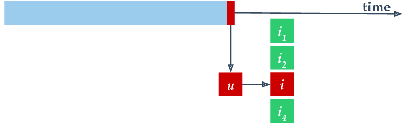
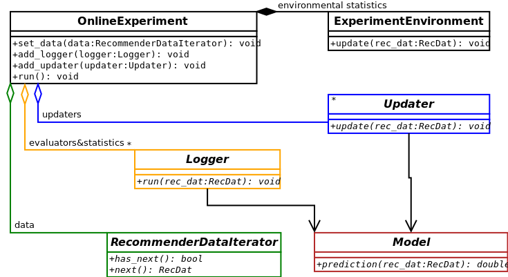
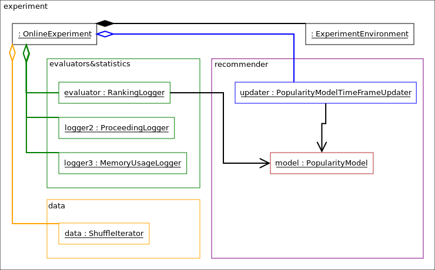
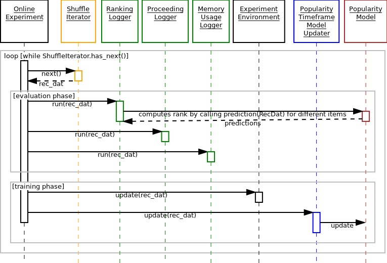
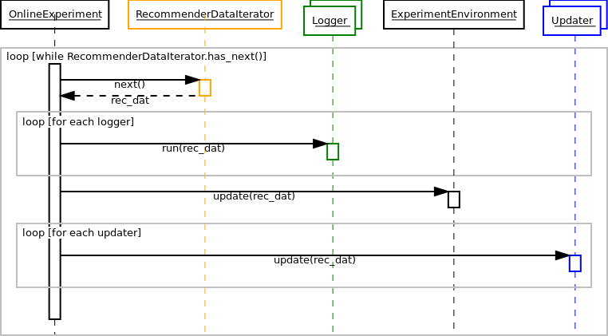
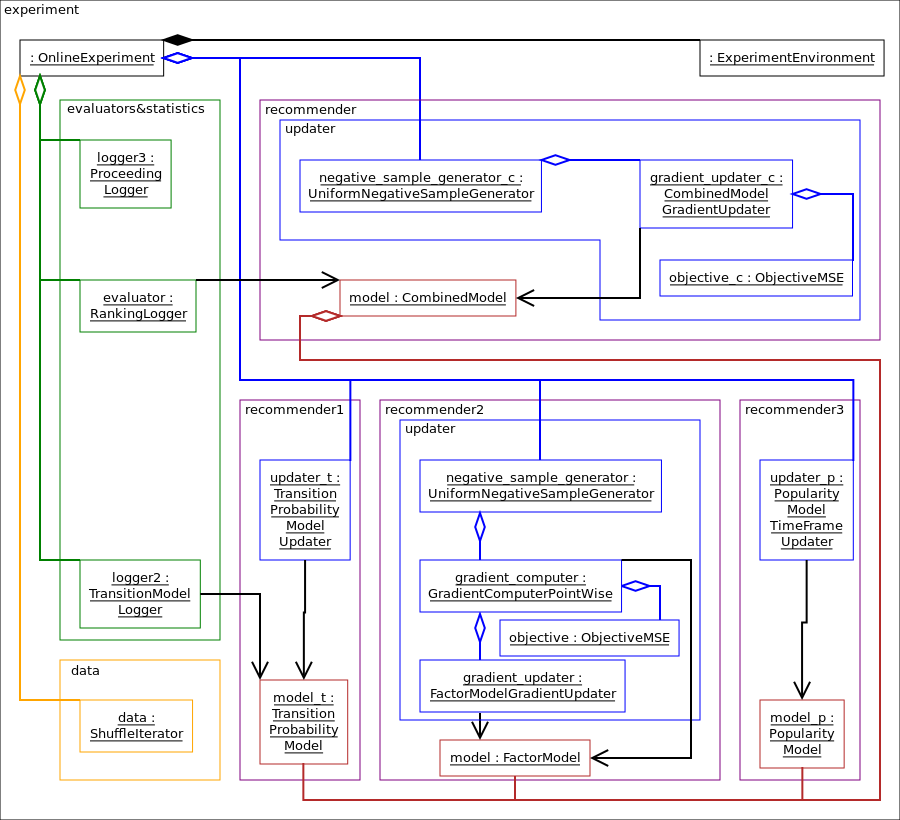

The anatomy of an online experiment
===================================

General structure of the online experiment
------------------------------------------

The online experiment runs on a time series of samples, each containing a user-item pair.
We treat the time series as a stream, performing two steps for each sample.
First, we evaluate the recommender, using the sample as an evaluation sample.
One possible evaluation method is to query a toplist for the user (without revealing the item), check if the correct item is included and to compute the rank of the correct item.
Second, after the evaluation, we append the sample to the end of the available training data and allow the recommender model to update itself.
Normally, we perform an incremental update step using only the newest item.

In our implementation, the central class that manages the process described above is :py:class:`alpenglow.cpp.OnlineExperiment`.
The data, the evaluators and the training algorithms are set into this class, using the appropriate function.
They have to implement the appropriate interfaces, as depicted on the UML class diagram.

Read more about the interfaces in :doc:`/general/cpp_api`.

An example: time frame based popularity model experiment
--------------------------------------------------------

Consider a time frame based popularity model experiment for example.
Below you can see the object diagram of this experiment.

This experiment contains

- a :py:class:`alpenglow.cpp.OnlineExperiment` that is the central class of the experiment,
- a :py:class:`alpenglow.cpp.ShuffleIterator` that contains the time series of the data,
- a :py:class:`alpenglow.cpp.ExperimentEnvironment` that contains common statistics etc.,
- a :py:class:`alpenglow.cpp.PopularityModel` in the role of the recommender model,
- a :py:class:`alpenglow.cpp.MemoryRankingLogger` in the role of the evaluator,
- a :py:class:`alpenglow.cpp.ProceedingLogger` and a :py:class:`alpenglow.cpp.MemoryUsageLogger` that log some info about the state of the experiment,
- a :py:class:`alpenglow.cpp.PopularityTimeFrameModelUpdater` in the role of an updater.

The building and wiring of such experiment will be explained later.
Now consider the function call sequence of :py:meth:`alpenglow.cpp.OnlineExperiment.run` that runs the experiment.
Below you can see the sequence diagram of this function.

The sequence diagram contains a huge loop on the timeline of the samples.
Each sample is considered only once.

There are two phases for each sample, the evaluation and the training phase.
In the evaluation phase, we call the :py:meth:`alpenglow.cpp.Logger.run` function of the loggers.
The function of the three loggers in this experiment:

- :py:class:`alpenglow.cpp.MemoryRankingLogger` computes the rank of the correct item by querying the score of the known items (calling :py:meth:`alpenglow.cpp.PopularityModel.prediction`) and writes it into a file and/or into a container.  Note that while ``prediction`` is not a ``const`` function, it doesn't change the state of the model.  Doing so would ruin the correctness of the experiment.  Read more about rank computation in :doc:`/general/rank_computing_optimization`.
- :py:class:`alpenglow.cpp.ProceedingLogger` logs the state of progress of the experiment to the screen, i.e. how many percents of the data is already processed.
- :py:class:`alpenglow.cpp.MemoryUsageLogger` logs the current memory usage into a file.

In the training phase, first the central class updates the common statistic container,:py:class:`alpenglow.cpp.ExperimentEnvironment`.
After that, the updater of the model is called.
The updater contains model-specific code and updates the model directly through friendship.

In the next cycle, all of these is called with the next saple, and so on, until the last sample is processed.

General call sequence
---------------------

The general function call sequence of :py:meth:`OnlineExperiment.run()` that runs the online experiment is depicted on the sequence diagram.
The recommender model is not depicted here, although loggers and updaters may access it as necessary, see the popularity model above for an example.

During the evaluation phase, ``online_exeriment`` passes the sample to each :py:class:`alpenglow.cpp.Logger` object that are added into it.
Loggers can evaluate the model or log out some statistics as well.
This is the evaluation phase for the sample, consequently, to keep the validity of the experiment, the loggers are not allowed to update the model or change its state.

During the second phase, when the sample becomes a training sample, ``online_experiment`` calls ``update()`` to each updater notify them about the new sample.
First update is called to :py:class:`alpenglow.cpp.ExperimentEnvironment` that updates some common containers and statistics of the training data, e.g. the number of the users, the list of most popular items.

Then the updaters of the recommender models are called also.
In the general case, model updating algorithms are organised into a chain, or more precisely into a DAG_.
You can add any number of :py:class:`alpenglow.cpp.Updater` objects into the experiment, and the system will pass the positive sample to each of them.
Some :py:class:`alpenglow.cpp.Updater` implementations can accept further :py:class:`alpenglow.cpp.Updater` objects and passes them further the samples, possibly completed with extra information (e.g. gradient value) or mixed with generated samples (e.g. generated negative samples).
Note that while the updating algorithms are allowed to retrain the model using the complete training data from the past, most of them uses only the newest sample or only a few more chosen from the past.

The experiment finishes when there are no more samples in the time series.

 .. _DAG: https://en.wikipedia.org/wiki/Directed_acyclic_graph

Examples
--------

In what follows, we give object diagrams for a few experiments.

The depenedency injection mechanism in our python framework sets automatically :py:class:`alpenglow.cpp.ExperimentEnvironment` to objects that require it (see :py:mod:`alpenglow.Getter` and :py:class:`alpenglow.cpp.NeedsExperimentEnvironment` for details).
Through this class, the experiment data (:py:class:`alpenglow.cpp.RecommenderDataIterator`) is also accessible.
As these two are available for any objects in the experiment, we omit the connections between these two and other objects.

Time-frame based popularity experiment
^^^^^^^^^^^^^^^^^^^^^^^^^^^^^^^^^^^^^^

Recall the object diagram.

The python code that builds this experiment is the following.
Note that most of the connections on the UML diagram correspond to a :py:meth:`set_xxxx()` or an :py:meth:`add_yyyy()` call.

This code is mostly for illustration.
In most of the cases, one can use the pre-built experiments in :py:mod:`alpenglow.experiments`, see :py:class:`alpenglow.experiments.PopularityTimeframeExperiment`.

.. code-block:: python

    from alpenglow.Getter import Getter as cpp
    import alpenglow
    import pandas as pd
    
    
    cpp.collect() #see general/memory usage
    
    #data
    data_python = pd.read_csv("http://info.ilab.sztaki.hu/~fbobee/alpenglow/alpenglow_sample_dataset")
    data_cpp_bridge = alpenglow.DataframeData(data_python)
    data = cpp.ShuffleIterator(seed=12345)
    data.set_recommender_data(data_cpp_bridge)
    
    #recommender: model+updater
    model = cpp.PopularityModel()
    updater = cpp.PopularityTimeFrameModelUpdater(
        tau = 86400
    )
    updater.set_model(model)
    
    #loggers: evaluation&statistics
    logger1 = cpp.MemoryRankingLogger(
        memory_log = True
    )
    logger1.set_model(model)
    ranking_logs = cpp.RankingLogs() #TODO get rid of these 3 lines
    ranking_logs.top_k = 100
    logger1.set_ranking_logs(ranking_logs)
    logger2 = cpp.ProceedingLogger()
    logger3 = cpp.MemoryUsageLogger()
    
    #online_experiment
    #Class experiment_environment is created inside.
    online_experiment = cpp.OnlineExperiment(
        random_seed=12345,
        top_k=100,
        exclude_known=True,
        initialize_all=False
    )
    online_experiment.add_logger(logger1)
    online_experiment.add_logger(logger2)
    online_experiment.add_logger(logger3)
    online_experiment.add_updater(updater)
    online_experiment.set_recommender_data_iterator(data)
    
    #clean, initialize, test (see general/cpp api)
    objects = cpp.get_and_clean()
    cpp.set_experiment_environment(online_experiment, objects)
    cpp.initialize_all(objects)
    for i in objects:
        cpp.run_self_test(i)
    
    #run the experiment
    online_experiment.run()
    
    result = logger1.get_ranking_logs()

Matrix factorization experiment
^^^^^^^^^^^^^^^^^^^^^^^^^^^^^^^

In this experiment, we have multiple updaters, chained into eachother.

.. image:: class_diagram_factor_color.png

See :py:class:`alpenglow.experiments.MatrixFactorizationExperiment`.

Combined model experiment
^^^^^^^^^^^^^^^^^^^^^^^^^

In this experiment, the DAG of updaters is more complex.

See :doc:`/general/combination/`.
