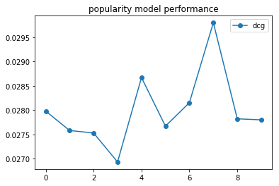
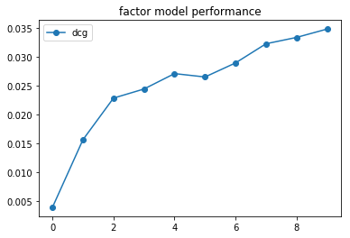
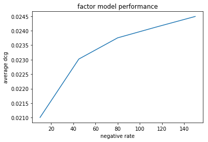

Five minute tutorial
====================

In this tutorial we are going to learn the basic concepts of using Alpenglow by evaluating various baseline models on real world data.

The data
--------

We will use the dataset at http://info.ilab.sztaki.hu/~fbobee/alpenglow/alpenglow_sample_dataset. This is a processed version of the  `30M dataset <http://info.ilab.sztaki.hu/~fbobee/alpenglow/recoded_online_id_artist_first_filtered>`, where we

- only keep users above a certain activity threshold
- only keep the first events of listening sessions
- recode the items so they represent artists instead of tracks

Let's start by importing standard packages and Alpenglow; and then reading the csv file using pandas. To avoid waiting too much for the experiments to complete, we limit the amount of records read to 200000.

.. role:: python(code)
   :language: python

.. code-block:: python

	import pandas as pd
	import matplotlib
	import matplotlib.pyplot as plt
	import alpenglow as ag

	data = pd.read_csv('http://info.ilab.sztaki.hu/~fbobee/alpenglow/alpenglow_sample_dataset', nrows=200000)
	print(data.columns)

Output::

	Index(['time', 'user', 'item', 'score', 'eval', 'category'], dtype='object')

To run online experiments, you will need time-series data of user-item interactions in similar format to the above. The only required columns are the :python:`'user'` and :python:`'item'` columns -- the rest will be autofilled if missing. The most important columns are the following:

- **time**: integer, the timestamp of the record. Controls various things, like evaluation timeframes or batch learning epochs. Defaults to :python:`range(0,len(data))` if missing.
- **user**: integer, the user the activity belongs to. This column is required.
- **item**: integer, the item the activity belongs to. This column is required.
- **score**: double, the score corresponding to the given record. This could be for example the rating of the item in the case of explicit recommendation. Defaults to constant :python:`1`.
- **eval**: boolean, whether to run ranking-evaluation on the record. Defaults to constant :python:`True`.

Our first model
---------------

Let's start by evaluating a very basic model on the dataset, the popularity model. To do this, we need to import the preconfigured experiment from the package :py:mod:`alpenglow.experimens`.

.. code-block:: python

	from alpenglow.experiments import PopularityExperiment

When creating an instance of the experiment, we can provide various configuration options and parameters.

.. code-block:: python

	pop_experiment = PopularityExperiment(
	    top_k=100, # we are going to evaluate on top 100 ranking lists
	    seed=12345, # for reproducibility, we provide a random seed
	)

You can see the list available options of online experiments in the documentation of :py:class:`alpenglow.OnlineExperiment` and the parameters of this particular experiment in the documentation of the specific implementation (in this case :py:class:`alpenglow.experiments.PopularityExperiment`) or, failing that, in the source code of the given class.

Running the experiment on the data is as simple as calling :python:`run(data)`. Multiple options can be provided at this point, for a full list, refer to the documentation of :py:meth:`alpenglow.OnlineExperiment.OnlineExperiment.run`.

.. code-block:: python

	result = pop_experiment.run(data, verbose=True) #this might take a while

The :python:`run()` method first builds the experiment out of C++ components according to the given parameters, then processes the data, training on it and evaluating the model at the same time. The returned object is a :py:class:`pandas.DataFrame` object, which contains various information regarding the results of the experiment:

.. code-block:: python

	print(result.columns)

Output::

	Index(['time', 'score', 'user', 'item', 'prediction', 'rank'], dtype='object')

Prediction is the score estimate given by the model and rank is the rank of the item in the toplist generated by the model. If the item is not on the toplist, rank is :python:`NaN`.

The easiest way interpret the results is by using a predefined evaluator, for example :py:class:`alpenglow.evaluation.DcgScore`:

.. code-block:: python

	from alpenglow.evaluation import DcgScore
	results['dcg'] = DcgScore(results)

The :py:class:`DcgScore` class calculates the NDCG values for the given ranks and returns a :py:class:`pandas.Series` object. This can be averaged and plotted easily to visualize the performance of the recommender model.

.. code-block:: python

	daily_avg_dcg = results['dcg'].groupby((results['time']-results['time'].min())//86400).mean()
	plt.plot(daily_avg_dcg,"o-", label="popularity")
	plt.title('popularity model performance')
	plt.legend()

Putting it all together:

.. code-block:: python

	import pandas as pd
	import matplotlib
	import matplotlib.pyplot as plt
	from alpenglow.evaluation import DcgScore
	from alpenglow.experiments import PopularityExperiment

	data = pd.read_csv('http://info.ilab.sztaki.hu/~fbobee/alpenglow/alpenglow_sample_dataset', nrows=200000)

	pop_experiment = PopularityExperiment(
	    top_k=100,
	    seed=12345,
	)
	results = pop_experiment.run(data, verbose=True)
	results['dcg'] = DcgScore(results)
	daily_avg_dcg = results['dcg'].groupby((results['time']-results['time'].min())//86400).mean()

	plt.plot(daily_avg_dcg,"o-", label="popularity")
	plt.title('popularity model performance')
	plt.legend()

Matrix factorization, hyperparameter search
-------------------------------------------

The :py:class:`alpenglow.experiments.FactorExperiment` class implements a factor model, which is updated in an online fashion. After checking the documentation / source, we can see that the most relevant hyperparameters for this model are :python:`dimension` (the number of latent factors), :python:`learning_rate`, :python:`negative_rate` and :python:`regularization_rate`. For this experiment, we are leaving the factor dimension at the default value of 10, and we don't need regularization, so we'll leave it at its default (0) as well. We will find the best negative rate and learning rate using grid search.

We can run the :python:`FactorModelExperiment` similarly to the popularity model:

.. code-block:: python

	from alpenglow.experiments import FactorExperiment

	mf_experiment = FactorExperiment(
	    top_k=100,
	)
	mf_results = mf_experiment.run(data, verbose=True)
	mf_results['dcg'] = DcgScore(mf_results)
	mf_daily_avg = mf_results['dcg'].groupby((mf_results['time']-mf_results['time'].min())//86400).mean()

	plt.plot(mf_daily_avg,"o-", label="factorization")
	plt.title('factor model performance')
	plt.legend()

The default parameters are chosen to perform generally well. However, the best choice always depends on the task at hand. To find the best values for this particular dataset, we can use Alpenglow's built in multithreaded hyperparameter search tool: :py:class:`alpenglow.ThreadedParameterSearch`.

.. code-block:: python

	mf_parameter_search = ag.utils.ThreadedParameterSearch(mf_experiment, DcgScore, threads=4)
	mf_parameter_search.set_parameter_values('negative_rate', np.linspace(10, 100, 4))

The :python:`ThreadedParameterSearch` instance wraps around an :python:`OnlineExperiment` instance. With each call to the function :python:`set_parameter_values`, we can set a new dimension for the grid search, which runs the experiments in parallel accoring to the given :python:`threads` parameter. We can start the hyperparameter search similar to the experiment itself: by calling :python:`run()`.

.. code-block:: python

	neg_rate_scores = mf_parameter_search.run(data, verbose=False)

The result of the search is a pandas DataFrame, with columns representing the given parameters and the score itself.

.. code-block:: python

	plt.plot(neg_rate_scores['negative_rate'], neg_rate_scores['DcgScore'])
	plt.ylabel('average dcg')
	plt.xlabel('negative rate')
	plt.title('factor model performance')

